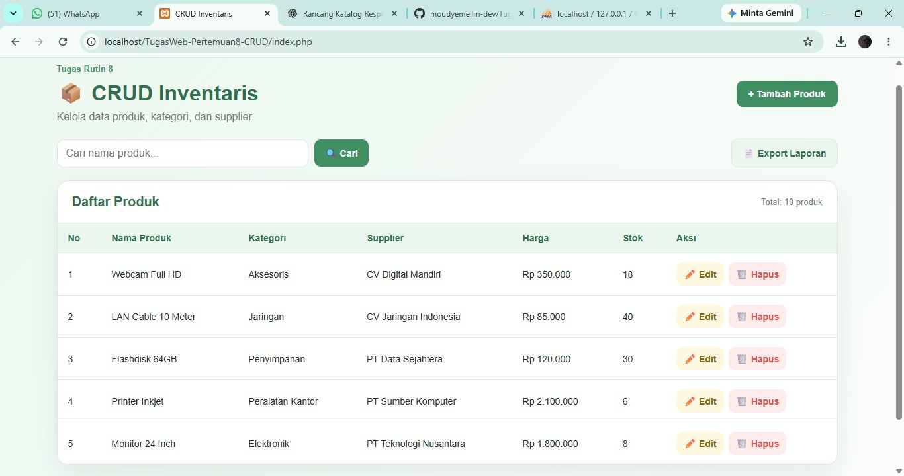
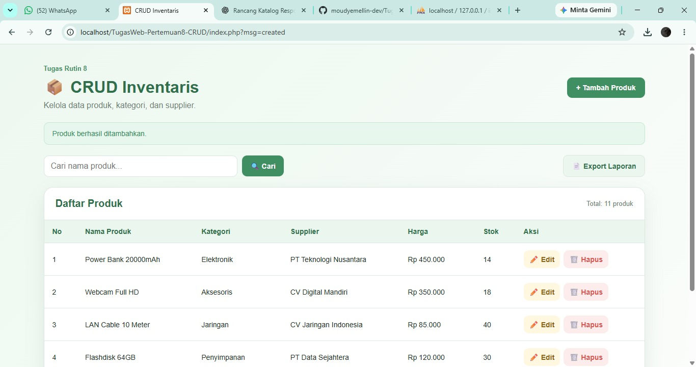

# Tugas Web Pertemuan 8 - CRUD Inventaris

Repository ini berisi Tugas Rutin Pertemuan 8 mata kuliah Pemrograman Web.

## Deskripsi

Aplikasi CRUD Inventaris dibuat menggunakan PHP Native, MySQL, dan PDO untuk mengelola data produk, kategori, serta supplier.

## Fitur Utama

- Menampilkan daftar produk
- JOIN tabel kategori dan supplier
- Tambah produk
- Edit produk dengan form pre-filled
- Hapus produk dengan konfirmasi
- Dropdown kategori dan supplier
- PDO dengan Singleton Pattern
- Prepared Statements
- Sanitasi output menggunakan `htmlspecialchars()`
- Flash message sukses dan gagal
- Responsive UI

## Fitur Bonus

- Transaction pada proses delete
- Activity log saat produk dihapus
- Pencarian produk
- Pagination
- Export laporan ke CSV

## Database

Database yang digunakan:

`inventaris_db`

Tabel utama:

- `categories`
- `suppliers`
- `products`

Tabel tambahan:

- `activity_logs`

## Screenshot Aplikasi

### Daftar Produk

### Tambah Produk

### Update Berhasil

## Cara Import Database

1. Jalankan Apache dan MySQL melalui XAMPP.
2. Buka `http://localhost/phpmyadmin`.
3. Pilih menu **Import**.
4. Pilih file `schema.sql` dari repository ini.
5. Klik **Go / Import**.
6. Database `inventaris_db` akan dibuat otomatis beserta tabel dan data awal.

## Cara Menjalankan Project

1. Simpan folder project di:

   `C:\xampp\htdocs\TugasWeb-Pertemuan8-CRUD`

2. Jalankan Apache dan MySQL melalui XAMPP.

3. Import file `schema.sql` ke phpMyAdmin.

4. Buka browser dan akses:

   `http://localhost/TugasWeb-Pertemuan8-CRUD/`

## Teknologi

- HTML5
- CSS3
- PHP Native
- MySQL
- PDO
- phpMyAdmin
- XAMPP

## Live Demo

🌐 [Buka CRUD Inventaris](https://moudy-crud8.page.gd)
